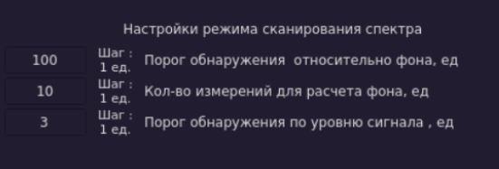

# Рабочие параметры детектора  
  
Текущая версия детектора может обнаруживать сигналы типа LoRa и аналоговое видео в автоматическом режиме.  

*Предварительные хар-ки обнаружения:*

- Обнаружение сигналов типа Lora - вероятность обнаружения зависит от дальности источника (тестировалось на макс. расстоянии до 2.2 км в прямой видимости, высота источника - 100 м - в данных условяих сигнал гарантированно обнаруживался). Вероятность распознавания сигнала зависит от установленного порога. В текущей версии минимальное значение установлено равным 75% и не может меняться пользователем в меньшую сторону.

- Обнаружение сигналов аналогового видео:  
 1: Вероятность правильного распознавания в режиме сканирования типовых рабочих частот, используемых в распространенных видеопередатчиках - более 95%. Текущие диапазоны - 900 МГц-1.3 ГГц, 2.4 ГГц, 3.3 ГГц, 5.6-5.8 ГГц.   
 2: Вероятность правильного обнаружения при сканировании по всем частотам:  
 -- в диапазоне от 900 МГц до 1.3 ГГц вероятность правильного распознавания более 95%
 -- в других диапазонах требуется уточнение

 *Питание прибора*

 - Входное напряжение питания, В: постоянное, 12 В
 - Типовой потребялемый ток: А: до до 5 А
 - Макс. потребялемый ток: А: до 6 А

 ## Работа с прибором

### Питание и внешние устройства
 

 На задней панели установлены:  
 - ВЧ-разъемы (1, 3 - передача, 2, 4 - прием), рабочий вход - 2 (в версии прибора Кирилла - зеркально расположены) для подключения антенн.
 - Кнопка включения питания - 5. Утопленная кнопка означает, что питание питание подается в прибор.  
 - Разъем для подключения питания (12В), два канала RS485 (сейчас не используются).

### Назначение кнопок
* 6 - Энкодер, служит для ввода параметров и выступает в роли кнопки ввода "Enter".
* 1 - По нажатию на эту кнопку вызывается меню перезагрузки/выключения, переход по элементам меню с помощью кнопки табуляции (2).
* 2 - Кнопка табуляции, перемещает фокус по доступным для взаимодествия элементам интерфейса.
* 3 - Выбор шага изменения параметров. Для частоты - шаг 1, 10, 100 МГц, для процентов - 0.1, 1, 10.
* 4 - Очистка списков обнаруженных сигналов
* 5 - Вызов/закрытие меню настроек
* 7 - Режим Лора - при нажатии на кнопку в основном окне приложения запускается режим обнаружения сигналов типа LoRa. При активном окне настроек переводит фокус на параметры данного режима.
* 8 - Режим видео - при нажатии на кнопку в основном окне приложения запускается режим обнаружения аналоговых видеосигналов. При активном окне настроек переводит фокус на параметры данного режима. 
* 9 - Режим сканирования спектра - режим, запускаемый по умолчанию. При включении прибора начинается накопление фона. При активном окне настроек переводит фокус на параметры данного режима.
* 10 - пока не используется 

 ### Порядок включения/выключения устройства

 - Штатное включение  
 Подключаем источник питания при выключенной кнопке питания.  
 Нажатием кнопки питания на задней панели включаем прибор.  

- Штатное выключение  
Нажатием кнопки выключения (1) на лицевой панели вызываем меню закрытия/перезагрузки/выключения. Кнопкой табуляции (2) выбираем пункт "Выключить" (см. рис. ниже). Активный пункт меню выделяется зеленым цветом. подтверждаем выбор нажатием на энкодер.
Дожидаемся появления на экране дисплея надписи "No signal" (для версий с HDMI-дисплеями) и выключаем питание прибора нажатием на копку включения питания на задней панели.

*Иной порядок выключения прибора может привести к повреждению встроенной ОС прибора!!!*

### Основное окно приложения
  
Приложение запускается автоматически при включении питания. После старта приложения происходит проверка работоспособности приемника и контроллера кнопок. До окончания тестирования информационные элементы в нижней части окна имеют статус "Приемник не готов" "Кросс не готов" и их индикаторы горят красным цветом.  
  

  
По завершении проверки статус инфопанелей меняется на "Приемник норм" "Кросс норм" и индикаторы горят зеленым цветом.  
По завершении проверки приемника и контроллера кнопок могут быть запущены основные рабочие режимы детектора - режим Лора и режим Видео нажатием соответсвующих кнопок на панели прибора. При первом выборе любого из режимов после старта приложения сначала должен загореться зеленый цвет на инфопанели "Драйвер".
Переключение между режимами детектирования осуществляется по нажатию кнопки, соответствующей выбираемому режиму.  
Изменение параметров выбранного и активного режима в окне быстрого выбора стартовой и стоповой частот или/и в окне настроек будет автоматически применено при окончании сканирования в предыдущем диапазоне частот. Для применения новых настроек, не дожидаясь конца сканирования, новые настройки будут применены при нажатии кнопки текущего выбранного режима.     

***
*Возможные проблемы*  
Красный цвет и надписи "Приемник не готов", "Кросс не готов" по истечении 5-8 сек после старта приложения сигнализируют о проблеме с приемником или контроллером кнопок. Дальнейшая работа с прибором невозможна.  
Зеленый цвет и надпись "Приемник норм" и красный цвет и надпись "Драйвер не готов" на соответствующих инфопанелях после нажатия на кнопку одного из рабочих режимов (Лора, Видео) сигнализирует о необходимости перезапуска прибора. Это производится путем нажатия на кнопку 1, выборе пункта "Перезагрузка" во всплывающем меню и нажатием на энкодер. Прибор перезагрузится, если после перезагрузки данная проблема не исчезнет, необходимо выключить прибор, кнопка 1, пункт "Выключить", дождаться выключения (в текущей версии прибора на экране появится надпись "No signal") и выключить внешнее питание. Через 15-20 сек подать внешнее питание, дождаться запуска прибора и попробовать запустить любой из рабочих режимов, если проблема сохраниться - прибор неработоспособен. 
*** 
  

На основном экране присутствую два элемента для быстрого выбора диапазона поиска - "Старт" и "Стоп". По умолчанию фокус на элементе "Старт", фокус переходит на "Стоп" по нажатию кнопки табуляции и возвращается обратно при следующем нажатии кнопки табуляции. Ввод параметров происходит на активном элементе (имеющем фокус) путем поворота энкодера с заданным шагом (шаг отображается справа), нажатие на энкодер записывает текущий параметр.
Шаг задается нажатием кнопки изменения шага (3), для задания частот шаг может принимать значение 1, 10, 100 МГц, для задания процентов - 0.1, 1, 10 %. Текущий шаг отображается справа от элемента/элементов на которые он влияет.   

### Окно настроек

Окно настроек служит для установки параметров рабочих режимов, управления звуком и выбором настроек.  
Вызов/закрытие окна происходит по нажатию на кнопку (5) настройки.
Включает в себя три раздела с отдельной навигацией по элементам - настройки приложения, настройки режима Лоры, настройки режима видео.
Навигация по элементам происходит при нажатии кнопки (2) табуляции.  
При вызове окна настроек фокус переключается между элементами настройки приложения - звук, выбор файла настроек (пользовательский/по-умолчанию), запись новых настроек в пользовательский файл, выбор канала (каналов), стартовая частота второго канала, время обновления обнаруженных сигналов в минутах.
При нажатии кнопок режимов происходит передача фокуса на элементы настроек выбранного режима. При повтороном нажатии кнопки режима фокус переходит на кнопку ГУИ "Запись" панели настройки приложения,      

#### Общие настройки  
  
Общие настройки включают три элемента, слева направо, вкл/выкл звукового оповещения, выбор настроек по-умолчанию/пользовательские, запись настроек пользователя и информационное поле с серийным номером изделия.  
Переход между элементами общих настроек по кнопке табуляции (2), активация/переключение по нажатию на энкодер. 

Вкл/выкл звукового оповещения - состояние "включено" индицируется зеленым цветом, дублируется на нижней инфопанели приложения в правом нижнем углу.  
Выбор настроек по-умолчанию/пользовательские, зеленый цвет - выбраны настройки по умолчанию, красный - пользовательские.
Запись настроек пользователя при фокусе на ней активируется нажатием энкодера, все текущие настройки записываются в файл пользовательских настроек.

#### Настройка режима сканирования спектра

- Порог обнаружения относительно фона
- Количество измерений для расчёта фона
- Порог обнаружения по уровню сигнала

#### Настройки режим LoRa  
  

  
- Порог для частотной области - задает в % степень совпадения эталона с обнаруженным сигналом, увеличение пар-ра снижает кол-во ложных обнаружений, снижает вероятность обнаружения слабых сигналов.  
- Порог для определения по ширине спектра - вспомогательный пар-р, в процессе тестирования.  
- Кол-во циклов повторения - пар-р, повышающий вероятность обнаружения сигналов Лора в режиме ППРЧ (ERLS, TBS).

#### Настройки режим видео  

  
  
- Выбор частотной сетки - позволяет выбрать типовые частотные диапазоны, в которых работают аналоговые видеопередатчики, один из них или все. "Авто" - в данном режиме сканируется заданный частотный диапазон ( диапазон задают выставленные частоты СТАРТ и СТОП в основном окне приложения), в частотной области ищутся сигналы, превышающие порог для частотной области (следующий пар-р в настройках режима), на следующем проходе на данных частотах производится поиск видеосигнала.
- Порог для частотной области - пороговое значение, определяющее наличие сигнала заданной величины для последующей проверки на соответствие аналоговому видео.
- Включение предварительного анализа спектра. Для режима "АВТО" всегда включено.
* * Включен - перед проходом по типовым частотным диапазонам производится анализ в частотной области для нахождения сигналов, превышающих заданный порог. Данный параметр может увеличить скорость сканирования по типовым частотам, проверяя только те, где существует активность. В зависимости от величины порога может ухудшиться вероятность обнаружения по сравнению с режимом прохода по типовым частотам без предварительного частотного анализа.
* * Выключен - проход по типовым частотным диапазонам без предварительного анализа частотного диапазона. Повышается вероятность обнаружения и правильного детектирования видео для типовых аналоговых передатчиков. Уменьшается скорость сканирования при выборе всех диапазонов. Нет возможности пользователю задать свои частоты.

#### Удаленный доступ по MQTT

- Передача данных
1. Топик video/detected - передается частота последнего обнаруженного аналогового видеосигнала. 
2. Топик lora/detected - передается частота последнего обнаруженного сигнала LoRa, вероятность правильного обнаружения которого составляет не менее 85%. Также передаются обнаруженные сигналы в режиме "авто" - формат: "Ч-та : xxxx МГц, время обнаружения". 
3. Топик spectr/detected -  пока передается инфо о каждом обнаруженном сигнале строкой: "Ч-та : xxxx МГц, кол.: xx, ур: xxx, время обнаружения". (Потом упакуем в массив част-т, сигналы на которых превышают порог. Формат флоат, МГц).
Также передаются обнаруженные сигналы в режиме "авто" - формат: "Ч-та : xxxx МГц, время обнаружения". 
4. Топик spectr - передается текущий измеренный спектр, бинарный массив, формат точки в массиве - флоат(4 байта).

- Прием данных
Прибор подписывется на получение всех подтопиков в топике settings/#. Пар-ры в каждом топике настроек передаются с разделителем ",". Кол-во параметров и их порядок должны совпадать с указанными ниже настройками для каждого топика.

1. Топик settings/lora - настройки режима LoRa  
    Порядок следования пар-ров:   
    спектр.порог (флоат, проценты), временной порог(флоат, проценты),кол-во циклов сканирования(целое, пределы 5-40), начальная час-та(флоат, 400МГц-900МГц), конечная час-та сканирования(флоат, 500МГц-1000МГц). 
    *Пример: settings/lora 70.0,5.0,10,400.0,1000.0*
    Предельные пар-ры: {{"60.0","99.0"},{"1.0","100.0"},{"10","40"},{"400.0","900.0"},{"500.0","1100.0"}},

2. Топик settings/video - настройки режима видео  
    Порядок следования пар-ров:
    currentMode","tresholdSpectr","videoStart","videoStop","spectrOn
    режим сканирования(целое, номер режима), порог(флоат, проценты), начальная час-та(флоат, 900МГц-5000МГц), конечная час-та сканирования(флоат, 1300МГц-6000МГц),вкл/выкл предварительного сканирования спектрав режимах сканирования по сеткам (целое, 0/1 соответственно).

    ##### Режимы сканирования:
    1.  Авто - 0 (сканируем спектр в заданном диапазоне, все превышения порога проверяем на совпадение видео)  
    2.  Скан в сетке 900МГц - 1.3ГГц - 1
    3.  Скан в сетке 3.3ГГц - 2
    4.  Скан в сетке 5.8ГГц - 3
    5.  Скан в сетке 2.4ГГц - 4
    6.  Скан по всем сеткам - 10

    *Пример: settings/video 1,5.0,900.0,6000.0,0 - режим 2(см список выше, порог 5.0(в данном режиме не учитывается, но записывается в настройки, част-ты не учитываются в режимах скана по сетке, но записываются в настройки, 0 - предварительный анализ спектра выключен))*
    Предельные пар-ры: {{"0","1","2","3","4","10"},{"1.0","100.0"},{"900.0","5500.0"},{"1300.0","6000.0"},{"0","1"}}

3. Топик settings/spectr - настройки режима спектра
   В данном режиме сканируем всю полосу от 400 до 6000 МГц всегда. Пар-ры - количество измерений для оценки фона, порог для разностного сигнала, вспомогательный порог по уровню разностного сигнала.
   Предельные пар-ры: {{"400.0","400.0"},{"6000.0","6000.0"},{"1.0","100.0"},{"100","1000"},{"1.0","5.0"}}

4. Топик settings/error - данный топик служит для обратной связи, сюда нарпалвяется сообщение об ошибке, если переданные пар-ры не соответствуют предельным для выбранного режима или принятое количество пар-ров больше или меньше требуемого количества параметров для выбранного режима. Формат сообщения - ERROR: номер режима (0 - лора, 1 - видео, 2 - спектр). 

- Удаленное переключение режимов  
  
  Отправка сообщения (ожет быть пустое) в топик:
  1. mode/lora - переключение в режим Лора
  2. mode/video - переключение в режим Видео
  3. mode/spectr - переключение в режим Спектр
